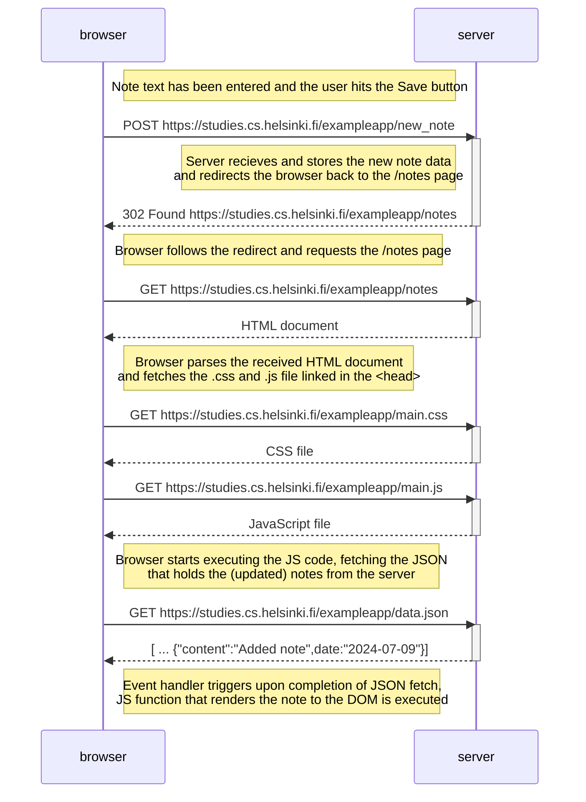
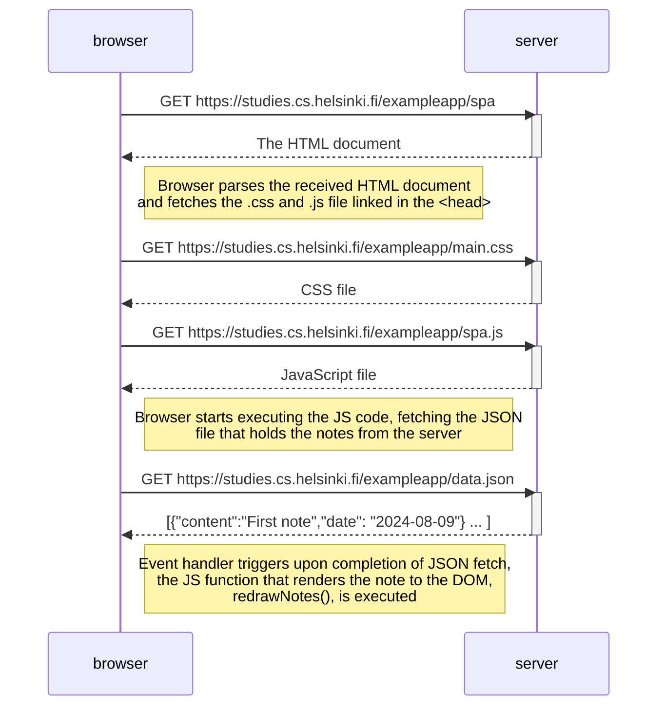
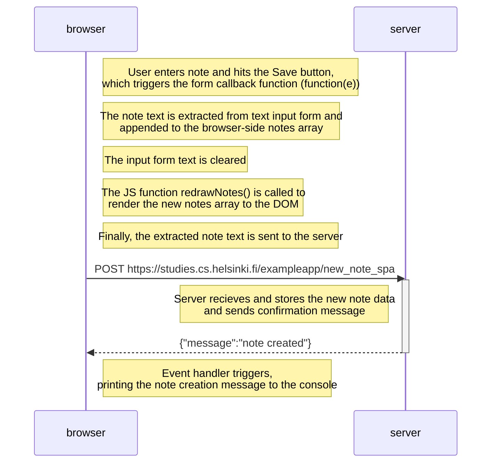

# Part 0

## 0.4 New note diagram

```mermaid
sequenceDiagram
  participant browser
  participant server

  Note right of browser: Note text has been entered and the user hits the Save button
  browser->>server: POST https://studies.cs.helsinki.fi/exampleapp/new_note
  activate server
  Note left of server: Server recieves and stores the new note data <br> and redirects the browser back to the /notes page
  server-->>browser: 302 Found https://studies.cs.helsinki.fi/exampleapp/notes
  deactivate server

  Note right of browser: Browser follows the redirect and requests the /notes page
  browser->>server: GET https://studies.cs.helsinki.fi/exampleapp/notes
  activate server
  server-->>browser: HTML document
  deactivate server

  Note right of browser: Browser parses the received HTML document <br> and fetches the .css and .js file linked in the <head>
  browser->>server: GET https://studies.cs.helsinki.fi/exampleapp/main.css
  activate server
  server-->>browser: CSS file
  deactivate server

  browser->>server: GET https://studies.cs.helsinki.fi/exampleapp/main.js
  activate server
  server-->>browser: JavaScript file
  deactivate server

  Note right of browser: Browser starts executing the JS code, fetching the JSON <br> that holds the (updated) notes from the server
  browser->>server: GET https://studies.cs.helsinki.fi/exampleapp/data.json
  activate server
  server-->>browser: [ ... {"content":"Added note",date:"2024-07-09"}]
  deactivate server

  Note right of browser: Event handler triggers upon completion of JSON fetch, <br> JS function that renders the note to the DOM is executed
```

## 0.5 Single page app diagram

```mermaid
sequenceDiagram
  participant browser
  participant server

  browser->>server: GET https://studies.cs.helsinki.fi/exampleapp/spa
  activate server
  server-->>browser: The HTML document
  deactivate server

  Note right of browser: Browser parses the received HTML document <br> and fetches the .css and .js file linked in the <head>
  browser->>server: GET https://studies.cs.helsinki.fi/exampleapp/main.css
  activate server
  server-->>browser: CSS file
  deactivate server

  browser->>server: GET https://studies.cs.helsinki.fi/exampleapp/spa.js
  activate server
  server-->>browser: JavaScript file
  deactivate server

  Note right of browser: Browser starts executing the JS code, fetching the JSON <br> file that holds the notes from the server
  browser->>server: GET https://studies.cs.helsinki.fi/exampleapp/data.json
  activate server
  server-->>browser: [{"content":"First note","date": "2024-08-09"} ... ]
  deactivate server

  Note right of browser: Event handler triggers upon completion of JSON fetch, <br> the JS function that renders the note to the DOM, <br> redrawNotes(), is executed
```

## 0.6 New note in the Single page app diagram

```mermaid
sequenceDiagram
  participant browser
  participant server

  Note right of browser: User enters note and hits the Save button, <br> which triggers the form callback function (function(e))
  Note right of browser: The note text is extracted from text input form and <br> appended to the browser-side notes array
  Note right of browser: The input form text is cleared
  Note right of browser: The JS function redrawNotes() is called to <br> render the new notes array to the DOM 
  Note right of browser: Finally, the extracted note text is sent to the server
  browser->>server: POST https://studies.cs.helsinki.fi/exampleapp/new_note_spa
  activate server
  Note left of server: Server recieves and stores the new note data <br> and sends confirmation message
  server-->>browser: {"message":"note created"}
  deactivate server
  Note right of browser: Event handler triggers, <br> printing the note creation message to the console
```